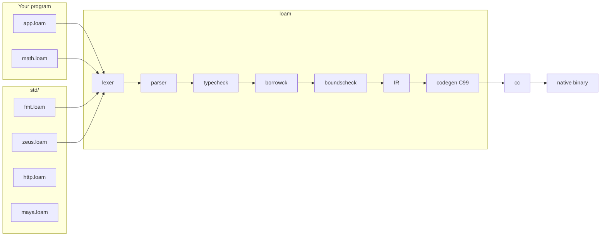

# Loam language

Loam is a memory-safe systems language: Odin-like syntax, Rust-like ownership.
`loam` is written in C11, typechecks a program, lowers it to IR, emits C99,
and invokes `cc`. C is the **platform binding target**, not the language's
semantics.

Language rules live in [spec.md](spec.md). C vs Loam: [boundary.md](boundary.md).
Loam vs C and Rust: [loam-vs-c-and-rust.md](loam-vs-c-and-rust.md).
Self-improvement phases: [downsides.md](downsides.md).
This file is architecture plus how to write and run programs.

## Architecture



Pipeline, in order:

| Stage | Where | What it does |
|---|---|---|
| Load | `src/compile.c` | Resolve `import "std:bar"` → `std/bar.loam`, relative `"path.loam"` from the importer. Cycles are errors. |
| Lex / parse | `src/lexer.c`, `src/parser.c` | Tokens → AST. |
| Typecheck | `src/sema/typecheck.c` | Names, types, auto-borrow, generics (monomorphized, including nested calls and defaults), `mod.fn` / `mod.global`, method rewrite `n.w(32)` → `zeus.w(n, 32)`. |
| Borrowck | `src/sema/borrowck.c` | Exclusive vs shared, moves, place paths (`p.a` vs `p.b`). Borrows end at the holder's last use (NLL). Enforces `#[must_check]`. |
| Boundscheck | `src/sema/boundscheck.c` | Proven in-range indexes skip the runtime trap. |
| IR | `src/ir.c` | CFG, drops, closures as heap env + fn pointer (`loam_fn`: fn, env, env_size). |
| C | `src/codegen_c.c` | C99, then `cc`. |

Ownership state (from the spec):

```
Owned ──copy──► Owned
Owned ──move──► Moved
Owned ──&────► Borrowed ──last use──► Owned
Owned ──&mut─► MutBorrowed ──last use──► Owned
Owned ──scope exit──► Dropped   (free boxes / []T / closures)
```

`Box<T>` is not Copy. `[]T` is Copy when `T` is Copy (refcounted buffer,
copy-on-write on `push`). `fn` values are Copy handles. They are freed when
the last owner drops (vectors) or interned for the process (handlers).

## Repository map

```
loam/
  loam/           the language
    src/          compiler (C11)
    std/          language libraries (Loam)
    runtime/      loam_rt (language) + host shims (not library protocol C)
    tests/        compile_pass / compile_fail / golden / draw_golden / inlang / bench
  nob.loam        the build and test tool (`bin/nob`; `make` forwards to it)
  zeus/           the framework: hosts/ (Cocoa, iOS, Android, Canvas2D), docs/
  tooling/
    tree-sitter-loam/  grammar
    editors/      editor integrations (Zed, Cursor/VS Code)
  examples/
    language/     standalone demo .loam programs (not test fixtures)
    zeus/         zeus apps (gallery, dashboard, myapp scaffold) + full-stack counter example
  bin/loamc       the compiler
  bin/loam-lsp    editor diagnostics / hover (incl. doc comments) / go-to-def / completion / semantic tokens
  bin/loam-fmt     formatter (one style, no options)
```

Std modules today: `fmt` (print), `zeus` (UI), `http`, `maya` (tiny 3D),
`thread` (OS threads + `Chan<T>` for CPU-bound work; Send discipline keeps
workers off module state — native/iOS/Android only, wasm `spawn` is a no-op).

Document them with `///` above each `fn` / `struct` and `//!` at the top of the
file. Hover in the editor shows those comments plus the type.

### Module resolution

Three import forms, one per kind of dependency:

| Form | Resolves to | Use for |
|---|---|---|
| `import "std:name"` | `packages/loam/std/name.loam`, then each `LOAM_PATH` root's `std/name.loam` | language std and frameworks |
| `import "path.loam"` | relative to the importing file | files shipped with this module |
| `import "pkg:name"` | `vendor/name/name.loam`, searched upward from the entry | vendored third-party code |

The `std:` search path is a real path, not "`std/` next to the compiler".
`packages/loam/std/` holds the language core (`fmt`, `net`, `sys`, `thread`, `math`,
`str`, `time`, `kv`, `json`, `result`, `test`); `zeus`, `http`, and `maya` are
**frameworks** that live outside `loam/` and are found because `LOAM_PATH`
names their roots (`packages/zeus/std/zeus.loam`, `packages/http/std/http.loam`, …). Language std
is searched first, so a framework cannot shadow `std:fmt`. Relative imports
are for a module's own siblings (`packages/zeus/std/router.loam` →
`"zeuscore/platform.loam"`), never for dependencies.

## How to use the language

Build the compiler once from the repo root:

```
make
```

`make` is only a bootstrap: it compiles a seed `bin/loamc`, then runs
[`nob.loam`](../nob.loam) (`nob build`), which owns the incremental build. The
same program runs the suite (`./bin/nob test`, or `make test`).

### 1. Hello

`hello.loam`:

```loam
import "std:fmt"

fn main() {
    fmt.println("hello, loam")
}
```

```
./bin/loamc hello.loam -o hello
./hello
```

`fmt.println` is compile-time lowering to length-based writes. It is not
`printf`.

Useful flags:

```
./bin/loamc app.loam -o app          # binary
./bin/loamc app.loam --emit-c -o a.c # C99
./bin/loamc app.loam --emit-ir -o a.ir
./bin/loamc app.loam --run           # compile and run
./bin/loamc app.loam --target wasm -o app.wasm  # Canvas2D .wasm (clang wasm32)
./bin/loamc --target=ios --run examples/zeus/dashboard/dashboard.loam  # Simulator
./bin/loamc --target=android examples/zeus/counter/android/app.loam  # Gradle project
```

### App C seams

Bodyless fns are not just for std: any fn whose body is missing is an **extern
C hook** (`loam_<module>_<name>`, no Loam body emitted — see
[boundary.md](boundary.md)). Std modules resolve theirs in `loam_rt` / the
runtime headers; an app resolves its own by shipping one C file:

- `runtime/<app>_runtime.c` beside the entry program is compiled and linked
  automatically for native targets (`driver.c`), and
- `LOAM_LINK_EXTRA="path.c …"` appends extra `.c`/`.o` inputs for entries
  that share a seam (CLI tools, smoke tests).

GreenInfer is the working example (`examples/zeus/greeninfer/`): Loam owns
all engine logic; the C file is only the NEON kernel and mmap trampolines.

### Compile time

`loam` itself is fast (tens of milliseconds to typecheck and emit C). Linking
a Zeus app is where the seconds go: generated C is hundreds of kilobytes, and
on macOS a GUI build also compiles Cocoa.

What `loam` does about that:

- Runtime files (`zeus_plat.c`, `zeus_key.c`, `packages/zeus/hosts/desktop/mac.m`) compile once into
  `packages/loam/runtime/.obj/` and are reused until those sources change.
- `ZEUS_HEADLESS=1` (tests) skips Cocoa and uses `-O0` on generated C.
- GUI builds use `-O1` on generated C, not `-O2` (same overflow checks,
  much less optimizer work).

Set `LOAM_TIME=1` to print `check` / `codegen` / `cc` timings on stderr.

`--target wasm` emits a Canvas2D `.wasm` (no WebGPU). Apple `/usr/bin/clang`
has no `wasm32` target; use Homebrew LLVM and `LOAM_WASM_CC`. See
`packages/zeus/docs/spec.md`.

`--target ios` builds an iOS Simulator `.app`. Zeus still paints its own
theme (fill / text / clip / SVG). UIKit is only the window and touch
host — not buttons, navigation bars, or iOS semantic colors. The
dashboard is a full-screen canvas; `zeus.App` size is ignored. Needs
Xcode. Device signing is out of scope.

`--target android` writes a Gradle project that links a JNI Canvas host
the same way: Zeus paints; Android widgets are not used. Layout is in
density-independent pixels. `--run` needs the Android SDK, NDK, Gradle
8.2+, and `adb`. The counter example talks to the Mac backend at
`10.0.2.2:8080` from the emulator.

### 2. Structs, borrows, heap

```loam
import "std:fmt"

struct Counter {
    name: string,
    count: int,
}

fn increment(c: &mut Counter) {
    c.count += 1
}

fn greet(c: &Counter) {
    fmt.println("hello,", c.name)
}

fn main() {
    let mut c = Counter { name: "tick", count: 0 }
    increment(&mut c)     // explicit
    increment(c)          // auto-borrow as &mut
    greet(c)              // auto-borrow as &
    let b = Box::new(42)
    fmt.println("boxed:", *b)
}
```

`let` is immutable, `let mut` is mutable. Passing an owned place to a `&T` /
`&mut T` parameter inserts the borrow. A stored borrow is live only up to the
holder's **last use** (NLL-style liveness), so the borrowed place is free again
afterward:

```loam
let mut x = 1
let p = &mut x
*p = 2
x = 3            // legal: p is dead after `*p = 2`
```

### 2b. Error handling: `Res<T>`

There is no `Result` type system, no `?`, and no pattern matching. The one
checked container is `Res<T>` (`std:result`), marked `#[must_check]`:

```loam
import "std:result"

let r = http.call(c, "Counter.Increment", body)
if r.ok {
    use(decode_Count(r.val))
}
```

A `#[must_check]` value that is dropped without reading any field — or
discarded as a bare expression statement — is a **compile error**. `res.or(x)`
gives the value or a default; `res.or_trap()` gives the value or traps with
`r.err`. `http.call` returns `Res<string>`; its optional REST counterparts stay
plain values.

### 3. Arrays and generics

```loam
import "std:fmt"

fn sum(xs: &[]int) -> int {
    let mut s = 0
    for i in 0..xs.len {
        s += xs[i]
    }
    return s
}

fn main() {
    let mut v = []int {}
    push(v, 10)
    v.push(20)
    fmt.println(sum(v))
}
```

`[]T` is a growable vector (`push` / `pop` / `.len`). Copy when `T` is Copy
(refcount on the buffer; `push` copy-on-writes if shared). Index traps unless
the compiler proved the index in range. `struct Pair<T> { a: T, b: T }` is
monomorphized; `Pair { a: 1, b: 2 }` infers `Pair<int>`.

`int` is `i32` and `float` is `f32` by default. Sized widths are also
available:
`i8`/`i16`/`i32`/`i64`, `u8`/`u16`/`u32`/`u64`, and `f32`/`f64`. Numeric
literals are untyped until context gives them one (`let p: u8 = 200`); a
literal that does not fit its target is a compile error. Widths never mix
implicitly: `a: i32 + b: i64` is an error, and conversions are explicit and
call-shaped — `i64(x)`, `f32(x)`, `u8(x)` (also `x as u8`). Converting to a
width that cannot hold the value traps, as does `u32(5) - u32(10)` (unsigned
underflow). Opt out with `wrapping_u8(x)` / `saturating_u8(x)`, or with the
per-width arithmetic builtins `wrapping_add` / `wrapping_sub` / `wrapping_mul`
/ `wrapping_neg` / `wrapping_shl` / `wrapping_shr` / `wrapping_and` /
`wrapping_or` / `wrapping_xor` and `saturating_add` / `saturating_sub` /
`saturating_mul`, whose width comes from their operands. `+ - *` trap on
overflow at every width. `s[i]` is the unsigned byte at `i`. Things that must
stay 64-bit (clocks, hashes, large byte counts) are listed in
`docs/numeric-widths.md`.

### 4. Modules

Quoted imports only. No glob, no `use`.

| Spec | Loads | Call as |
|---|---|---|
| `import "std:fmt"` | `std/fmt.loam` | `fmt.println(...)` |
| `import "math.loam"` | `math.loam` next to this file | `math.add(2, 40)` |
| `import "../mod/math.loam"` | relative to the importer | `math.add(...)` |

The module name is the file stem (`math`), or `bar` from `std:bar`.

Functions: `mod.fn(...)`. Module-level `let` bindings are places:
`counter.n += 1`.

`lib.loam`:

```loam
let mut n: int = 0

fn bump() {
    n += 1
}
```

`app.loam`:

```loam
import "std:fmt"
import "lib.loam"

fn main() {
    lib.bump()
    lib.bump()
    fmt.println(lib.n)
}
```

Method call `node.w(32)` looks up `w` in the current file, then in imported
modules, and rewrites to `zeus.w(node, 32)` when `w` lives in `zeus`. That is why
`import "std:zeus"` is enough for widgets and trailing blocks.

### 5. Closures

```loam
fn main() {
    let add = |a: int, b: int| { a + b }
    let n = add(2, 40)
}
```

Captures must be Copy. `fn` values are Copy handles (shared env). They may be
returned or stored. Zeus intern (`plat_intern_fn`) memcpy's that env using
`env_size`, so a click handler still sees captured `Signal`s after the stack
frame that created the closure is gone.

### 6. Tests

`std:test` is the in-language test module. `#[test]` marks a parameterless,
value-less fn; `loam test app.loam` compiles a runner that calls every
`#[test]` fn (entry module and imports, in declaration order) through
`std:test`, and the entry file must `import "std:test"`:

```loam
import "std:test"

#[test]
fn addition() {
    test.assert(1 + 1 == 2)
}
```

```
./bin/loamc test tests.loam
# test addition ... ok
# 1 test(s) passed
```

`test.assert(cond)`, `test.assert_eq_int(a, b)`, and `test.assert_eq_str(a, b)`
are ordinary Loam in `std/test.loam`, built on the `panic(msg)` primitive. A
failed assertion traps and the run exits non-zero:

```
test addition ... .../std/test.loam:36: panic: assertion failed (in test addition)
```

A trap aborts the run (there is no unwinding yet — `Boundary` is a later phase),
so the suite stops at the first failure; the name printed before the panic and
the `(in test …)` tag on the message identify which test failed.

The repository's own suite is [`nob.loam`](../nob.loam). `nob test` (or `make
test`) builds the compiler and runs the language suites — `compile_pass`,
`compile_fail`, the golden programs and DRAW goldens, `inlang`, and the
`argv`/`fs`/`watch` probes — plus the host checks that sit next to the compiler
(wasm entry points, server/client split, LSP). The `zeli`-driven suite (routes,
build, pkg, fmt, serve) is `nob integration`, deliberately not part of `test`:
it is the slow and most environment-sensitive part. Both take `-j N` (default
4) and print each result as it finishes.

### 7. Debug info

Generated C carries `#line` directives pointing at the `.loam` source, so the C
compiler's own warnings and errors name Loam lines. With `LOAM_DEBUG=1`, `loam`
also compiles the native target with `-g`, so lldb / gdb, profilers, and
sanitizers report Loam `file:line` for stack frames and non-panic crashes:

```
LOAM_DEBUG=1 ./bin/loamc app.loam -o app
```

`-g` is off by default, because it inflates binaries.

### 8. Text, Unicode, and fonts

`string` is bytes: `s[i]` is one byte and `s.len` is a byte count. Two std
modules sit above that for the "text in-tree" work:

- `std:unicode` — UTF-8 decode and **extended grapheme clusters** (UAX #29):
  `codepoint`, `next_cp`, `prev_cp`, `next_grapheme`, `prev_grapheme`,
  `grapheme_count`, `grapheme_start`. `Input` caret movement, backspace, and
  delete step by cluster, so a Tamil akshara or an emoji ZWJ sequence moves as
  one unit instead of one code point.
- `std:font` — TrueType/OpenType table parsing (`head`, `maxp`, `hhea`, `hmtx`,
  `cmap` formats 4 and 12) and metrics: `glyph_index`, `advance_px`,
  `text_width`, `line_height`, `measure`, `measure_wrap`. `measure` and
  `measure_wrap` are pure functions of (font bytes, pixel size, string), which is
  what makes text layout host-independent. `glyph_run(text)` returns the
  positioned glyph ids a `plat_glyphs` draw consumes. Metrics and runs are
  unshaped (one glyph per cluster), so complex-script widths and ligatures are
  approximate until a shaper lands (`loam_zeus_v2.md` §1.4).

In-language tests live in `packages/loam/tests/inlang/unicode_tests.loam` and
`font_tests.loam`; the font fixture is `packages/loam/tests/fonts/tiny.ttf`,
regenerated by `make_tiny_font.py` beside it.

`zeus.use_font(src)` binds an external font — a file path on desktop, a URL on
the web — so layout measures with `std:font` instead of the host:

```loam
zeus.load_font("Inter", "./fonts/Inter.ttf")   // host draws with it
zeus.use_font("./fonts/Inter.ttf")             // layout measures with it
```

`use_font_bytes(bytes)` binds bytes the app already holds (the web path). Both
return 1 on success; on 0 the host's own measurement stays in effect, so
callers should not assume the face is present.

### Use cases

| You want | Start with |
|---|---|
| A CLI or algorithm | `import "std:fmt"`, `fn main()` |
| CPU-bound work off the UI thread | `import "std:thread"` — `spawn` a closure, return results through a `Chan<T>` drained on the UI thread |
| A desktop UI | [zeus.md](zeus.md) — `import "std:zeus"` |
| A tiny RPC server | `import "std:http"` (`examples/language/http_server.loam`) |
| A 3D/2D toy scene | `import "std:maya"` (`examples/language/solar.loam`) |
| Grapheme-correct text | `import "std:unicode"` for cluster boundaries; `import "std:font"` for in-tree metrics |

Corpus you can compile as examples:

- `packages/loam/tests/compile_pass/hello.loam`, `vec.loam`, `globals.loam`, `import_math.loam`
- `examples/language/counter.loam`, `fib.loam`, `http_server.loam`
- Failures the checker must reject: `packages/loam/tests/compile_fail/*.loam`

```
make && make test        # or: ./bin/nob build && ./bin/nob test
```
